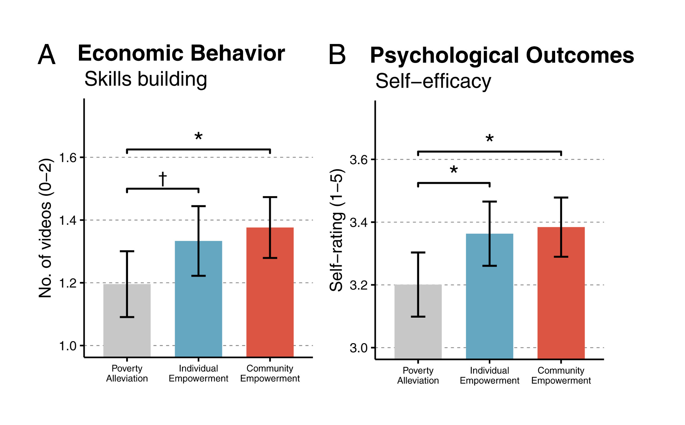

# Introduction

We're reproducing some data from Thomas et al. (2020), "Toward a science of delivering aid with dignity: Experimental evidence and local forecasts from Kenya." 

[Catherine is a student and former TA in the course.]

In particular, we'll focus on Study 1: Experimental Impacts of Aid Narratives on Recipients.

The idea is to reproduce the basic effects of treatment that they saw, in particular, people who got a cash transfer heard that it was from either 1)  a community empowerment organization, 2) a poverty alleviation organization, or 3) an individual empowerment organization. Com (condition 1) and Ind (condition 3) recipients were found to watch more business education videos, and reported greater self efficacy and mobility and less stigma.

Data from: [https://www.pnas.org/content/117/27/15546]()

Repository: [https://osf.io/v3cr4/]() 

This is an example of a pretty nicely organized repository that includes a readme, a great codebook, all code and data, etc. 

```{r}
library(knitr)
library(tidyverse)

theme_set(theme_classic())
          
load("data/KenyaData.RData")
```

Key variables are `treat` (treatment condition), `vid.num`, and various psychological treatments. We'll focus on self-efficacy.

Let's make the appropriate composite for self-efficacy, copied from their code:

```{r}
scale.means = function (df, ..., na.rm=FALSE) {
    vars = unlist(list(...))
    mean_vars = rowMeans(df[,vars], na.rm=na.rm)
    return(mean_vars)
}

for (var in c(k1_df$sel.con, k1_df$sel.pers, k1_df$sel.com, 
              k1_df$sel.prob, k1_df$sel.bett)) {
    var[var < 0] <- NA
}

k1_df$sel.score.avg <- scale.means(k1_df, "sel.con", "sel.pers", "sel.com", 
                                   "sel.prob", "sel.bett", na.rm = T)
k1_df$sel.score <- scale(k1_df$sel.con) + scale(k1_df$sel.pers) + 
  scale(k1_df$sel.com) + scale(k1_df$sel.prob) + scale(k1_df$sel.bett)
k1_df$sel.score.z <- scale(k1_df$sel.score)
```

# Descriptives

Always good to make histograms of the dependent variables (`sel.score.avg` and `vid.num`)! Use facets, fills, etc. to try and explore how these relate to treatment. 

```{r}
ggplot(data = k1_df,
       aes(x = sel.score.avg)) + 
  geom_histogram() + 
  facet_wrap(~treat)
```

```{r}
ggplot(data = k1_df,
       aes(x = vid.num)) + 
  geom_histogram() + 
  facet_wrap(~treat)
```


# Reproduce main analysis

Let's try to reproduce Figures 1A and 1B from the paper, pasted below:
```{r}

```


First, we'll reproduce the behavioral result that `vid.num` is influenced by `treat`! (Figure 1A). Build out this simple stub code. 

```{r}
k1_summary <- k1_df %>%
  group_by(treat) |>
  summarise(ci = 1.96 * sd(vid.num) / sqrt(n()),
            vid.num = mean(vid.num))

plot_1a = ggplot(data = k1_summary,
                 aes(x = treat,
                     y = vid.num,
                     fill = treat)) +
  geom_bar(stat = "identity") + 
  geom_errorbar(aes(ymin = vid.num - ci,
                    ymax = vid.num + ci),
                width = 0.2,
                size = 1) +
  ggtitle('Economic Behavior\n Skills building') +
  theme(text = element_text(size = 14),
        legend.position = 'None',
        legend.title = element_blank(),
        axis.title.x = element_blank(),
        axis.text.x = element_text(size = 9),
        axis.ticks.x = element_blank(),
        strip.background = element_blank(),
        strip.text = element_blank(),
        panel.grid.major.y = element_line(linetype = 'dashed',
                                          color = 'darkgray')) +
  scale_fill_manual(values = c('Pov' = 'lightgray',
                               'Ind' = 'skyblue3',
                               'Com' = 'coral2')) +
  scale_x_discrete(labels = c('Pov' = 'Poverty\nAlleviation',
                              'Ind' = 'Individual\nEmpowerment',
                              'Com' = 'Community\nEmpowerment')) +
  scale_y_continuous(name = 'No. of videos (0-2)',
                     breaks = seq(1.0, 1.8, 0.2)) +
  coord_cartesian(ylim = c(1, 1.75))

# plot_1a
```

Next, repeat this code to make Figure 1B for `sel.score.avg`. 

```{r}
k1_summary <- k1_df %>%
  group_by(treat) |>
  summarise(ci = 1.96 * sd(sel.score.avg) / sqrt(n()),
            sel.score.avg = mean(sel.score.avg))

plot_1b = ggplot(data = k1_summary,
                 aes(x = treat,
                     y = sel.score.avg,
                     fill = treat)) +
  geom_bar(stat = "identity") + 
  geom_errorbar(aes(ymin = sel.score.avg - ci,
                    ymax = sel.score.avg + ci),
                width = 0.2,
                size = 1) +
  ggtitle('Psychological Outcomes\n Self-efficacy') +
  theme(text = element_text(size = 14),
        legend.position = 'None',
        legend.title = element_blank(),
        axis.title.x = element_blank(),
        axis.text.x = element_text(size = 9),
        axis.ticks.x = element_blank(),
        strip.background = element_blank(),
        strip.text = element_blank(),
        panel.grid.major.y = element_line(linetype = 'dashed',
                                          color = 'darkgray')) +
  scale_fill_manual(values = c('Pov' = 'lightgray',
                               'Ind' = 'skyblue3',
                               'Com' = 'coral2')) +
  scale_x_discrete(labels = c('Pov' = 'Poverty\nAlleviation',
                              'Ind' = 'Individual\nEmpowerment',
                              'Com' = 'Community\nEmpowerment')) +
  scale_y_continuous(name = 'Self-rating (1-5)',
                     breaks = seq(3.0, 3.8, 0.2)) +
  coord_cartesian(ylim = c(3, 3.75))

# plot_1b
```

Bonus: we can use the `patchwork` library to put the plots side-by-side:
```{r}
library(patchwork)

plot_1a + plot_1b + plot_annotation(tag_levels = 'A')
```


# Show the distribution of data

Think about how you could show the distribution of data for the `sel.score.avg` figure in a way that helps with the interpretation. 

```{r}
ggplot(data = k1_summary,
       aes(x = treat,
           y = sel.score.avg)) +
  geom_jitter(data = data = k1_df,
              aes(x = treat,
                  y = sel.score.avg,
                  color = treat), 
              width = 0.1,
              alpha = 0.2) + 
  geom_pointrange(aes(ymin = sel.score.avg - ci, 
                      ymax = sel.score.avg + ci, 
                      col = treat)) + 
  theme(text = element_text(size = 14),
        legend.position = 'None',
        legend.title = element_blank(),
        axis.title.x = element_blank(),
        axis.ticks.x = element_blank(),
        strip.background = element_blank(),
        strip.text = element_blank(),
        panel.grid.major.y = element_line(linetype = 'dashed',
                                          color = 'darkgray')) +
  scale_color_manual(values = c('Pov' = 'darkgray',  # made it darker
                                'Ind' = 'skyblue3',
                                'Com' = 'coral2')) +
  scale_x_discrete(labels = c('Pov' = 'Poverty Alleviation',
                              'Ind' = 'Individual Empowerment',
                              'Com' = 'Community Empowerment')) +
  scale_y_continuous(name = 'Self-efficacy score')
```

# Exploratory analysis

Consider exploratory analysis of demographic variables and how they relate to the self-efficacy outcome variable (`sel.score.avg`). One way to do this is to create scatter plots of each outcome by the demographics and consider how this relationship is modulated by treatment condition.  

* `soc.fem` = gender
* `soc.age` = age
* `ses.unemployed` = employment
* `soc.sav` = savings > 1000ksh
* `soc.inc` = income

```{r}
ggplot(data = k1_df,
       aes(x = soc.age,
           y = sel.score.avg,
           col = treat)) +
  geom_point(alpha = 0.2) + 
  geom_smooth(method = "lm") + 
  theme(text = element_text(size = 14),
        legend.position = 'bottom',
        legend.direction = 'horizontal',
        legend.title = element_blank(),
        strip.background = element_blank(),
        strip.text = element_blank(),
        panel.grid.major.y = element_line(linetype = 'dashed',
                                          color = 'darkgray')) +
  scale_color_manual(values = c('Pov' = 'darkgray',  # made it darker
                                'Ind' = 'skyblue3',
                                'Com' = 'coral2'),
                     labels = c('Pov' = 'Poverty Alleviation',
                                'Ind' = 'Individual Empowerment',
                                'Com' = 'Community Empowerment')) +
  scale_x_continuous(name = 'Age') +
  scale_y_continuous(name = 'Self-efficacy score')
```

and 

```{r}
ggplot(k1_df, aes(x = soc.inc, y = sel.score.avg, col = treat)) +
  geom_point(alpha = 0.2) + 
  geom_smooth(method = "lm") + 
  theme(text = element_text(size = 14),
        legend.position = 'bottom',
        legend.direction = 'horizontal',
        legend.title = element_blank(),
        strip.background = element_blank(),
        strip.text = element_blank(),
        panel.grid.major.y = element_line(linetype = 'dashed',
                                          color = 'darkgray')) +
  scale_color_manual(values = c('Pov' = 'darkgray',  # made it darker
                                'Ind' = 'skyblue3',
                                'Com' = 'coral2'),
                     labels = c('Pov' = 'Poverty Alleviation',
                                'Ind' = 'Individual Empowerment',
                                'Com' = 'Community Empowerment')) +
  scale_x_continuous(name = 'Income') +
  scale_y_continuous(name = 'Self-efficacy score')
```